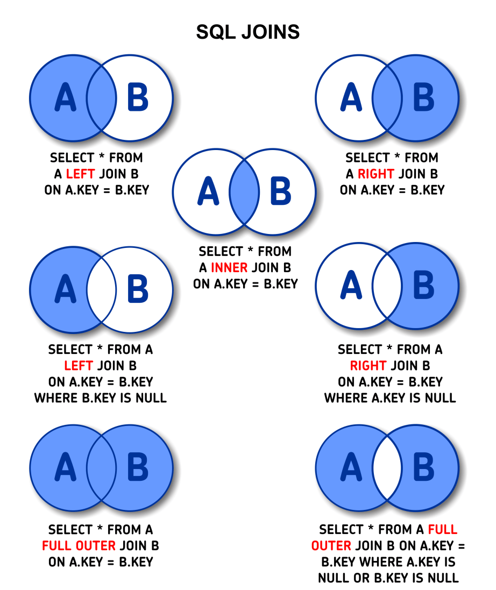

<!-- 데이터베이스에서 인덱스를 사용하는 이유 및 장단점에 대해 설명해주세요. -->
<details>
  <summary><span style="border-bottom:0.05em solid"><strong>데이터베이스에서 인덱스를 사용하는 이유 및 장단점에 대해 설명해주세요.</strong></span></summary>
<hr>
데이터베이스에서 인덱스를 사용하는 이유는 검색 성능을 향상시키기 위함입니다.

조회 속도가 빠르다는 장점이 있지만,
정렬된 상태를 계속 유지시켜줘야하기 때문에 데이터를 삽입, 수정, 삭제 시에 성능 저하가 발생할 수 있습니다.
또한, 인덱스를 관리하기 위해서는 데이터베이스에 추가적인 저장 공간이 필요합니다.
<br></br>

  <details>
    <summary><span style="border-bottom:0.05em solid"><strong>인덱스를 사용하면 좋은 경우</strong></span></summary>
    
    (1) 규모가 작지 않은 테이블에서

    (2) INSERT / UPDATE / DELETE가 자주 발생하지 않는 컬럼,

    (3) 혹은 JOIN / WHERE / ORDER BY에 자주 사용되는 컬럼,

    (4) 혹은 데이터의 중복도가 낮은 컬럼

  </details>
  <details>
    <summary><span style="border-bottom:0.05em solid"><strong>인덱스 테이블</strong></span></summary>
    B+Tree 형식으로 정렬되어 있는 INDEX 테이블을 이용하여 조회 속도를 향상시킬 수 있습니다.

    🔎 밸런스 트리(Balanced Tree)란?
    트리의 노드가 한 방향으로 쏠리지 않도록,
    노드 삽입 및 삭제 시 특정 규칙에 맞게 재정렬되어 왼쪽과
    오른쪽 자식 양쪽 수의 밸런스를 유지하는 트리이다.

    항상 양쪽 자식의 밸런스를 유지하므로,
    무조건 O(logN)의 시간 복잡도를 가지게 된다.

    하지만, 노드 삽입 및 삭제 시 발생하는 재정렬 작업 때문에
    탐색을 제외한 작업에서는 일반 Tree보다 성능이 좋지 않다.

  </details>
<hr>
</details>

<!-- 트랜젝션에 대해 설명해주세요. -->
<details>
  <summary><span style="border-bottom:0.05em solid"><strong>트랜젝션에 대해 설명해주세요.</strong></span></summary>
<hr>
트랜잭션이란 데이터베이스의 상태를 변화시키는 하나의 논리적인 작업 단위입니다.
원자성, 일관성, 독립성, 지속성의 특징을 가지고 있습니다.
<br></br>

  <details>
    <summary><span style="border-bottom:0.05em solid"><strong>트랜젝션의 4가지 특징</strong></span></summary>
  
    [원자성] A(Atomic)
    원자성은 Transaction을 구성하는 연산들이 모두 정상적으로 실행되거나 하나도 실행되지 않아야 한다는
    all-or-nothing방식을 의미합니다. 수행중에 한작업이라도 실패하면 전부를 rollback하고 모두 성공해야 commit합니다.
    [일관성] C(Consistency)
    Transaction이 성공적으로 수행된 후에도 데이터베이스가 일관된 상태를 유지해야 함을 의미합니다.
    Transaction이 수행되는 과정에서는 일관되지 않을 수 있어도 Transaction이 완료되면 데이터베이스가 일관된 상태를 유지해야됨을 의미합니다.
    [격리성] I(Isolation)
    현재 수행 중인 Transaction이 완료될 때까지 Transaction이 생성한 중간 연산 결과에 다른 Transaction들이 접근할 수 없음을 의미합니다.
    [지속성] D(Durability)
    데이터베이스에 반영한 수행결과는 어떠한 경우에도 손실되지 않고 영구적이어야 함을 의미합니다.
    시스템 장애가 발생하더라도 Transaction작업 결과는 없어지지 않고 데이터베이스에 그대로 남아있어야 한다는 의미입니다.
    장애 발생시 데이터베이스를 원상태로 복구하기 위함입니다.

  </details>
<hr>
</details>

<!-- Connection Pool과 사용하는 이유에 대해서 설명해주세요. -->
<details>
  <summary><span style="border-bottom:0.05em solid"><strong>Connection Pool과 사용하는 이유에 대해서 설명해주세요.</strong></span></summary>

<hr>

WAS(웹 컨테이너)가 실행 될 때 DB연결을 위해 미리 일정 수의 Connection 객체를 만들어 Pool에 저장했다가

사용자의 요청이 발생하면 Pool에서 생성되어 있는 Connection 객체를 빌려주고
사용자가 사용이 끝나면 Connection 객체를 다시 Pool에 반환하여 보관하는 기법입니다.
커넥션 풀을 사용하면 생성 비용과 시간을 줄이고 DB 접근 시간을 단축시킵니다.
또한, 미리 정해진 숫자의 Connection을 통해서 DB에 걸리는 부하를 조정하고 서버의 한정적인 자원을 효율적으로 사용할 수 있습니다.

  <details>
    <summary><span style="border-bottom:0.05em solid"><strong>Spring Application에서 Connection Pool의 Connection 수를 변경하는 방법과 기본값</strong></span></summary>

<b>Hikari Connection Pool의 경우 maximumPoolSize's default value = 10</b>

```java
@Configuration
public class DatasourceConfig {
  @Value("${spring.datasource.username}")
  private String username;

  @Value("${spring.datasource.password}")
  private String password;

  @Value("${spring.datasource.url}")
  private String url;

  @Bean
  @Qualifier("dataSource")
  @Primary
  public DataSource oingDataSource() {
      HikariConfig hikariConfig = new HikariConfig();

      hikariConfig.setUsername(username);
      hikariConfig.setPassword(password);
      hikariConfig.setJdbcUrl(url);
      hikariConfig.setMaximumPoolSize(75); // <- Size를 75로 조정

      return new HikariDataSource(hikariConfig);
  }
  ...
}

```

      or

```ssh
  // application.yml

  spring:
  datasource:
    hikari:
      maximum-pool-size: 50 <- Size를 50으로 조정
```

  </details>
<hr>
</details>

<details>
  <summary><span style="border-bottom:0.05em solid"><strong>Elastic Search의 키워드 검색과 RDBMS의 LIKE 검색의 차이에 대해 설명해주세요.</strong></span></summary>
<hr>
Elastic Search의 키워드 검색은 Inverted Index 구조로 데이터를 저장해서 키워드를 분리합니다.
동의어나 유의어를 활용한 검색이 가능하며, 비정형 데이터의 색인과 검색이 가능하고, 역색인 지원으로 매우 빠른 검색이 가능합니다.
또한, 형태소 분석을 통한 자연어 처리가 가능하다는 차이점이 있습니다.
<br></br>
반면, RDBMS는 LIKE 검색을 통해 와일드카드로 시작하지 않는 경우에만 인덱스를 사용하여 데이터 검색을 합니다.
그러나 단순 텍스트 매칭에 대한 검색만을 제공하고, 비정형 데이터의 색인과 검색이 불가능합니다.
<br></br>

  <details>
    <summary><span style="border-bottom:0.05em solid"><strong>🔎 Elastic Search</strong></span></summary>
    
    Elasticsearch는 Apache Lucene 기반의 오픈소스 실시간 분산 검색 엔진입니다
    Apache Lucene은 내부적으로 Inverted File Index를 활용하여 색인 구조를 생성합니다.
    이를 기반으로 하는 Elasticsearch 또한 동일한 방식으로 색인 구조를 생성하여 데이터를 저장합니다.

  </details>
  <details>
    <summary><span style="border-bottom:0.05em solid"><strong>Inverted Index (역색인)</strong></span></summary>
 
    역색인은 특정 키워드(Term)로 포함하고 있는 문서들에 대한 Primary Key를 맵핑하는 인덱스 테이블을 생성하며, 이 테이블을 활용하여 빠른 문서 탐색을 가능케 합니다.
    검색엔진에서 역색인 인덱스 테이블은 주로 BTree, Trie, Hash Table 등의 자료구조를 활용하여 구현됩니다.

  </details>
  <details>
    <summary><span style="border-bottom:0.05em solid"><strong>ES - 랭킹 알고리즘</strong></span></summary>

    Elastic Search는 랭킹 알고리즘을 통해서 가장 유사한 순서대로 결과를 나타냅니다.
    BM25(a.k.a Okapi BM25)는 주어진 쿼리에 대해 문서와의 연관성을 평가하는 랭킹 함수로 사용되는 알고리즘이며, BM25는 엘라스틱서치 5.0부터 default로 적용되었습니다.

  </details>
<hr>
</details>

<!-- RDBMS에서 JOIN과 그 종류에 대해 설명해주세요. -->
<details>
  <summary><span style="border-bottom:0.05em solid"><strong>RDBMS에서 JOIN과 그 종류에 대해 설명해주세요.</strong></span></summary>
<hr>

JOIN은 두 개 이상의 테이블을 묶어서 하나의 결과물을 만들어서 데이터를 검색하는 방법입니다.
(1) INNER JOIN : 두 테이블의 교집합, 즉 두 테이블간 JOIN 조건을 만족하는 행을 반환합니다.
(2) OUTER JOIN: 조인 조건에서 동일한 값이 없는 행도 같이 반환합니다.

- LEFT OUTER JOIN : 왼쪽 테이블의 모든 행이 결과 테이블에 표기됩니다.
- RIGHT OUTER JOIN : 오른쪽 테이블의 모든 행이 결과 테이블에 표기됩니다.
- FULL OUTER JOIN : 두 테이블을 기반으로 조인 조건에 만족하지 않는 행까지 모두 표기합니다.

(3) CROSS JOIN: Cartesian Product(카디션 곱)이라고도 하며 조인되는 두 테이블에서 곱집합을 반환합니다.
(4) SELF JOIN: 자기 자신의 속성과 조건에 맞는 튜플을 조인하는 것입니다.

<div style="width: 40%">



</div>

<hr>
</details>

<details>
  <summary><span style="border-bottom:0.05em solid"><strong>정규화에 대해서 설명해주세요.</strong></span></summary>
<hr>

정규화는 이상 현상이 발생하는 릴레이션을 분리하여 관계형 데이터베이스의 데이터에 존재하는 중복을 최소화하기 위한 작업을 의미합니다.

즉, 데이터의 중복을 없애고 데이터의 일관성, 무결성을 유지하는 과정을 의미합니다.

<br></br>

  <details>
    <summary><span style="border-bottom:0.05em solid"><strong>이상 현상의 종류</strong></span></summary>
    
    삽입 이상: 데이터를 추가할 때 부득이하게 NULL이 입력되는 현상
    삭제 이상: 삭제 시 연쇄삭제 현상이 발생하는 현상
    수정 이상: 수정 시 데이터의 일관성이 훼손되는 현상

  </details>
  <details>
    <summary><span style="border-bottom:0.05em solid"><strong>정규형 원칙</strong></span></summary>
 
    제 1정규형 : 릴레이션의 모든 도메인이 더 이상 분해될 수 없는 원자 값만으로 구성되어야 한다.
    제 2정규형 : 릴레이션이 제 1정규형이며 부분 함수의 종속성을 제거한 형태를 의미한다.
    제 3정규형 : 속성들이 이행적으로 종속되어 있는지 여부를 판단하는 것이다.

  </details>
 
<hr>
</details>

<details>
  <summary><span style="border-bottom:0.05em solid"><strong>역정규화를 하는 이유에 대해 설명해주세요.</strong></span></summary>
<hr>

관계형 데이터베이스에서 정규화된 데이터는 JOIN을 통해 관련된 정보를 함께 가져오기 때문에 정규화가 많이 이루어져 있는 데이터베이스의 경우 특정 데이터를 조회할 때 성능저하가 발생할 수 있습니다.

역정규화는 정규화를 통해 분리되었던 릴레이션에서 중복을 허용하고 다시 통합하거나 분할하여 구조를 재조정하여 DB의 전반적인 성능을 개선하기 위해서 사용되는 전략입니다.

<hr>
</details>

<details>
  <summary><span style="border-bottom:0.05em solid"><strong>ORM에 대해 설명해주세요.</strong></span></summary>
<hr>

ORM이란 Object Relational Mapping의 약자로

객체들의 관계를 바탕으로 SQL문을 자동으로 생성하여

관계형 데이터베이스의 레코드와 객체를 연결시켜주는 것을 의미합니다.

<details>
    <summary><span style="border-bottom:0.05em solid"><strong>ORM의 장점과 단점</strong></span></summary>
 
    [장점]
      직접 Query문을 작성하지 않기 때문에 비즈니스 로직에 집중할 수 있게 도와준다.
      재사용 및 유지보수가 편리하다.
      DBMS에 대한 족송성이 줄어든다.
    [단점]
      프로젝트가 복잡해지면 성능상의 문제가 발생할 수 있다.(N+1)
      DBMS의 고유 기능을 이용하기 어렵다.

  </details>

<hr>
</details>

<!-- 샤딩에 대해 설명해주세요. -->
<details>
  <summary><span style="border-bottom:0.05em solid"><strong>샤딩에 대해 설명해주세요.</strong></span></summary>
<hr>

샤딩(Sharding)은 동일한 스키마를 가지고 있는 데이터를 샤드라고 하는 더 작은 청크로 분할하여<br>
샤드키에 따라 여러개의 데이터베이스 서버에 나누어 저장하는 기법입니다.<br>
데이터에 접근할 때는 샤딩키를 사용하며 동적으로 DB 서버를 매핑하는 과정이 필요합니다.<br>
또한, DB 트래픽을 분산할 수 있는 중요한 수단이며, 특정 DB의 장애가 전면 장애로 이어지지 않게 하는 역할을 합니다.<br>

<details>
    <summary><span style="border-bottom:0.05em solid"><strong>샤딩 추가 설명</strong></span></summary>
 
한 데이터베이스에는 제한된 양의 데이터만 처리할 수 있는데<br>
어플리케이션에 저장되는 데이터의 양이 갈수록 증가하게 되면,<br>
동시에 정보를 읽거나 저장하는 사용자가 많아지게 되고,<br>
병목 현상이 자주 발생하게 되기 때문에 어플리케이션의 속도가 느려지고 사용자의 경험에 영향을 미칩니다.<br>

  </details>

<hr>
</details>

<!-- Redis의 정의와 장단점에 대해 설명해주세요. -->
<details>
  <summary><span style="border-bottom:0.05em solid"><strong>Redis의 정의와 장단점에 대해 설명해주세요.</strong></span></summary>
<hr>

Redis는 Remote Dictionary Server의 약자로 메모리 안에 key-value형태로 데이터를 저장하는 NoSQL입니다.<br></br>
Redis는 다양한 데이터형으로 영속성과 원자성을 지원하고
읽기 성능 증대를 위한 서버 측 복제를, 쓰기 성능 증대를 위한 클라이언트 샤딩을 지원한다는 장점이 있지만,<br></br>
싱글 스레드를 지원하기 때문에 대규모 데이터 처리 시 응답 속도가 불안정할 수 있으며, 메모리 파편화가 발생하기 쉽다는 단점이 있습니다.

<details>
    <summary><span style="border-bottom:0.05em solid"><strong>Redis 단점 보완 방법</strong></span></summary>

Redis는 데이터를 disk에 저장할 수 있습니다.<br>
따라서 Redis는 서버가 shutdown된 후에 restart 하더라도 disk에 저장해놓은 데이터를 다시 읽어서 데이터가 유실되지 않습니다. Redis는 데이터를 disk에 저장하는 방식은 snapshot, AOF 방식이 있습니다.<br>

- Snapshot : 스냅샷은 RDB에서도 사용하고 있는 어떤 특정 시점의 데이터를 DISK에 옮겨담는 방식을 뜻합니다. Blocking 방식의 SAVE와 Non-blocking 방식의 BGSAVE 방식이 있습니다.
- AOF : Redis의 모든 write/update 연산 자체를 모두 log 파일에 기록하는 형태입니다. 서버가 재시작할 시 write/update를 순차적으로 재실행, 데이터를 복구합니다.

위 방법은 인 메모리 방식을 사용하는 Redis에서 장애 발생 시 데이터가 유실 될 수 있는 단점을 보완할 수 있는 방법입니다.

  </details>

<hr>
</details>
