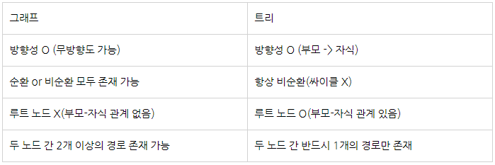

  
<strong>main 메서드를 override, overload 할 수 있는지</strong>

  

main 메서드는 **override 할 수 없고, overload 할 수 있습니다.**

**main 메서드는 static으로 선언되며**, **static** 메서드는 **컴파일** 시에 어떤 메서드를 실행할지 결정됩니다.
**overriding** 메서드는 **런타임** 시에 어떤 메소드를 실행할지 객체 타입에 따라 결정되기 때문에 override 할 수 없습니다.
**overloading** 메서드는 **컴파일** 시에 어떤 메소드를 실행할지 결정되기 때문에 overload 할 수 있습니다.

static이 아닌 메서드를 static 메서드로 오버라이드 할 수 없습니다. 마찬가지로 컴파일 에러가 발생하게 됩니다.

  

  
<strong>Static으로 선언되었다면?</strong>

객체는 Heap 영역에 할당되고, 객체 변수는 stack에 올라가 주소값을 가지고 있습니다.
하지만 static은 class 영역에 할당되기 때문에 가비지 컬렉터가 관여할 수 없습니다.
자세한 내용은 [JVM의 메모리 구조](https://codedragon.tistory.com/5297)를 참조하시기 바랍니다.

  

  

<!-- 클래스는 무엇이고 객체는 무엇인가요? -->

  
<strong>클래스는 무엇이고 객체는 무엇인가요?</strong>

  

  클래스는 객체지향 프로그래밍의 핵심 개념 중 하나로, 객체를 생성하기 위한 템플릿이며, 객체의 상태를 나타내는 필드와 객체의 행동을 나타내는 메소드로 구성되어있습니다.
  
  객체는 클래스에서 정의한 것을 토대로 메모리에 할당된 실체를 말하며, 수명주기동안 상태(필드)와 동작(메서드)를 가지고 다른 객체와 상호작용할 수 있습니다.
    
  

  
<strong>클래스와 객체의 메모리</strong>

객체는 클래스의 인스턴스로 메모리의 공간을 차지하여 필드에 상태를 저장하고 메서드로 동작을 표현합니다.

추가적으로 생성된 인스턴스들은 가비지 컬렉터에 의해 수집됩니다.
클래스는 인스턴스를 생성하기 전까지 파일 형태로 저장공간에 저장될 뿐 메모리의 힙 영역을 소모하지 않습니다.

  

  

<!-- 그래프와 트리의 차이점을 설명해주세요. -->

  
<strong>그래프와 트리의 차이점을 설명해주세요.</strong>

  

그래프는 노드와 노드 간을 연결하는 간선으로 구성된 자료구조이고, 트리는 그래프 중에서 방향성을 가지고, 비순환 구조로 되어있는 그래프를 트리라고 정의합니다.
  
트리는 상하 구조(부모-자식 관계)가 명확하고 싸이클(순환)이 일어나지 않는 그래프를 뜻하기 때문에
  트리는 그래프이지만, 그래프는 트리가 될 수 없습니다.
  
그래프가 개체 간의 '관계'를 표현했다면, 트리는 개체를 '계층'구조로 표현합니다.
  

  

  
<strong>배열과 링크드리스트의 차이에 대해 설명해주세요.</strong>

  

  
  배열은 선언될 때 크기가 특정(정적 메모리 할당)되기 때문에 메모리 공간 내에 연속적으로 존재하지만,
  연결리스트는 크기가 가변적(동적 메모리 할당)이기 때문에 메모리 상에서 연속적이지 않고 요소의 앞뒤 요소를 가리키는 포인터를 사용합니다.
  배열은 특정 위치(Index)의 요소를 조회하는데 유리하고,
  연결리스트는 앞 뒤에 요소를 추가하거나 삭제하는데 유리합니다.
  배열은 메모리의 Stack 영역, 연결리스트는 Heap 영역에 할당됩니다.

 

 

