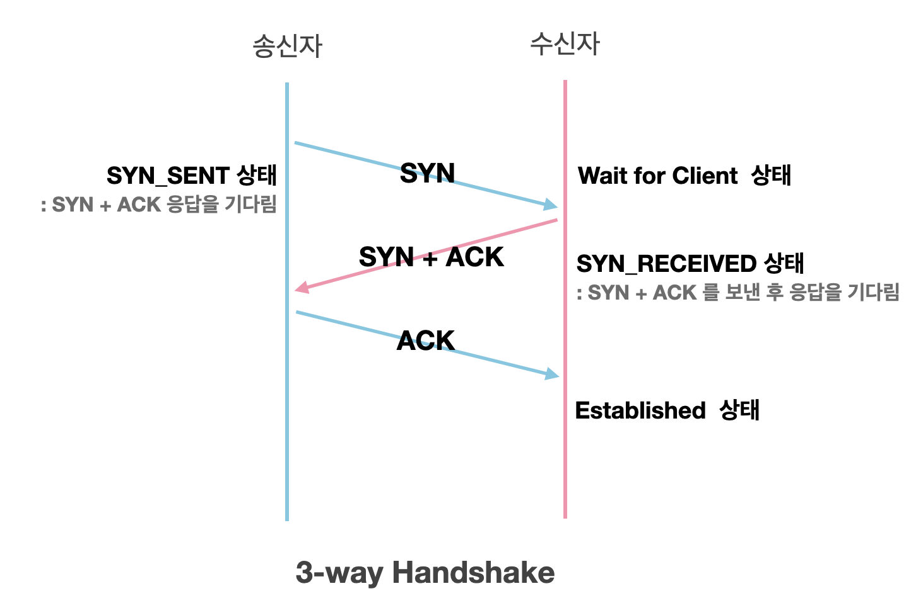
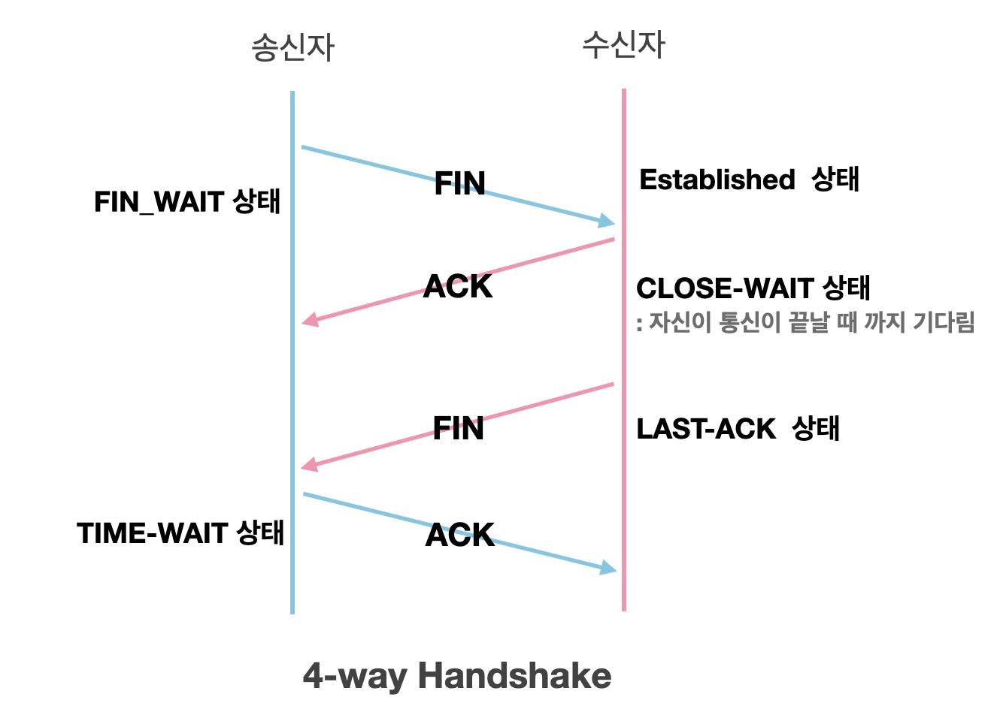

  
<strong>네트워크 토폴리지의 개념과 종류</strong>

  

  

네트워크 토폴리지: 네트워크에 배치된 노드와 링크의 연결 형태를 의미합니다.
네트워크에서 가장 기본이 되는 내용으로, 토폴로지의 종류와 각 특징 등을 간단하게라도 이해하고 계시는걸 권장드립니다.
 

### 참고용어

  
<strong>노드</strong>

서버, 라우터, 스위치 등 네트워크 장치를 의미합니다.

  
<strong>링크</strong>

유선 또는 무선을 의미합니다.

---

  
<strong>버스 토폴로지</strong>

  
중앙 통신 회선 하나에 여러 개의 노드가 연결되어 공유하는 네트워크 구성을 갖습니다. 주로 LAN에서 사용합니다.

---

### 장점

- 노드 추가와 삭제가 쉽고 설치 비용이 적습니다.
- 한 노드에 장애가 발생 해도 다른 노드에 영향을 미치지 않습니다.

### 단점

- 가운데 메인 링크에 많은 트래픽이 몰리면 정체현상이 발생하고 패킷 손실율이 높을 수 있습니다.
- 메인 링크에 장애가 발생 시 모든 노드에 영향을 미칠 수 있습니다.
- 스푸핑의 위험이 있습니다.

  
<strong>스타 토폴로지</strong>

중앙에 있는 노드 하나에 다른 모든 노드가 연결된 형태입니다.
다른 노드로 가려면 반드시 거쳐야 하는 중앙 노드는 특히 보안이 강화되어 있습니다.

---

### 장점

- 중앙의 메인 노드에 장애가 발생해도 다른 노드에 영향을 미치지 않습니다.
- 한 노드에 침해가 발생해도 다른 노드에 접근하기 어렵기 때문에 비교적 안정성이 높습니다.

### 단점

- 중앙 노드에 장애가 발생 시 전체 네트워크를 사용할 수 없습니다.

  
<strong>트리 토폴로지</strong>

계층형 토폴로지라고도 불립니다.
트리 형태를 갖기 때문에 리프 노드를 기반으로 한 노드 추가, 삭제는 쉬우나 그 이외에는 어렵습니다.

---

### 장점

- 리프 노드에서의 확장과 삭제가 용이합니다.

### 단점

- 루트 노드에 문제가 생기면 전체 노드에 영향을 미칠 수 있습니다.
- 특정 노드에 트래픽이 집중될 시 그 하위 노드에 영향을 미칩니다.

  
<strong>링형 토폴로지</strong>

고리 모양으로 연결된 형태입니다.

---

### 장점

- 노드 수가 많아져도 데이터 손실이 없습니다.
- 노드를 거치면서 토큰을 기반으로 통신권한 여부를 따지고 권한이 없는 노드는 데이터를 전달 받지 않습니다.

### 단점

- 링크 혹은 노드 중 한 곳에만 에러가 발생해도 전체 네트워크에 영향을 미칩니다.
- 기본적으로 토큰을 기반으로 하기 때문에, 토큰이 없는 노드는 통신에 참여를 못합니다.

  
<strong>메시 토폴로지</strong>

노드가 서로 연결된 그물망 형태를 갖습니다.
Full 메시 토폴리지와 Partial 메시 토폴리지가 있으며, Full은 모든 노드가 서로 연결된 형태, Partial은 부분적으로 노드들이 연결된 형태를 말합니다.
일반적으로 메시토폴리지라 함은 Full 형태를 말하며, Full의 특징을 기술하겠습니다.
(참고: Full의 경우 n \* (n - 1) / 2의 회선이 필요합니다.)

---

### 장점

- 한 노드 혹은 회선에 장애가 발생해도 다른 여러 개의 경로가 존재하므로 계속해서 네트워크를 사ㅏ용할 수 있습니다.
- 회선이 많기 때문에 트래픽 분산 처리에 용이합니다.

### 단점

- 모든 노드가 연결되어 있어 노드 추가, 삭제가 가장 어렵습니다.
  - 노드를 삭제 시 그와 연결 된 모든 노드와의 링크를 삭제해야 합니다.
  - 노드를 추가 시 다른 모든 노드와 링크를 연결해줘야 합니다.
- 회선이 많아 구축 비용이 고가입니다.

  
<strong>CORS에 대해 설명해주세요.</strong>

Cross Origin Resource Sharing(교차 출처 자원 공유)의 약자로
다른 출처에서 리소스를 가져오는 것을 제한하는 동일 출처 정책(SOP)과 반대로, 추가 HTTP 헤더를 사용하여
다른 출처에 있는 자원에 접근할 수 있는 권한을 부여하도록 브라우저에 알려주는 체제입니다. 
  

    
<strong>SOP(Same-Origin-Policy)란?</strong>

    동일출처정책이라는 의미로, 어떤 출처에서 불러온 문서나 스크립트가 다른 출처에서 가져온 리소스와 상호작용하는 것을 제안하는 보안 방식입니다.
  

  
<strong>HTTP와 HTTPS의 차이점에 대해 설명해주세요.</strong>

HTTPS는 기존의 HTTP에 Secure Socket Layer 계층을 하나 더 두어
HTTP 통신에서는 수행하지 않았던 데이터의 암호화를 통해 보안을 한층 더 높인 통신 기법입니다.

  
<strong>REST와 RESTful에 대해서 설명해주세요.</strong>

REST란
URI를 통해 자원을 명시하고,
METHOD를 통해 자원에 대한 CRUD Operation을 명시하는 방법으로
네트워크 상에서 Client와 Server사이의 통신 방식 중 하나입니다.

RESTful
REST의 원리를 따르며 REST API의 설계 규칙을 올바르게 지키는 것을 의미합니다.

  

    
<strong>REST API 설계 규칙</strong>

    
    1. /(구분자: 슬래쉬)는 계층 관계를 나타낼 때 사용합니다.
    2. URI의 마지막에는 /(구분자: 슬래쉬)를 사용하지 않습니다.
    3. -(하이픈)은 URI의 가독성을 높이는 데 사용합니다.
    4. _(언더바)는 URI에 사용하지 않습니다.
    5. URI경로에 대문자는 가급적 피합니다.
    6. 파일확장자는 URI에 포함시키지 않습니다.
    7. 리소스 간에 연관관계가 있는 경우에는 "/리소스명/{리소스ID}/연관관계가있는리소스명"으로 표현합니다.
  

  
<strong>네트워크 병목현상이 무엇인지 설명하고 개선할 수 있는 방법을 제시하세요.</strong>

  

대량의 트래픽이 한곳에 몰려 데이터 흐름이 제한되는 상황을 말합니다.
메모리 용량을 늘리거나 서버-클라이언트 간 네트워크 회선을 네트워크 토폴리지에 기반해서 늘리는 방법 등이 있습니다.

추가질문: 네트워크 토폴리지가 무엇인가요? (네트워크 토폴리지 부분 참고)

  
<strong>TCP/IP 계층과 OSI 7계층 간의 계층 구조 차이를 간단히 설명하세요.</strong>

  

전체적인 역할은 같으나 계층의 세분화에서 약간 다릅니다.
TCP/IP 계층의 애플리케이션 계층은 OSI 7계층에서 애플리케이션, 프레젠테이션, 세션 계층으로 나뉩니다.
링크 계층은 OSI 7계층에서 데이터링크, 물리 계층으로 나뉘어서 TCP/IP는 총 4계층으로 구성되어 있습니다.
그 외 전송 계층과 인터넷 계층이 동일하게 하나씩 있습니다.

  
<strong>HTTPS의 암호화 방식을 알고 있나요?</strong>

  

HTTP 요청이 오면 대칭키 또는 비대칭키 암호화 방식을 사용해 암호화 한 후에 응답 데이터를 보냅니다.

대칭키 암호화는 클라이언트와 서버가 동일한 키를 사용해 암호화/복호화를 하기 때문에 속도가 빠릅니다.
하지만 두 키중 하나만 노출돼도 복호화를 할 수 있어서 보안상 위험할 수 있습니다.

비대칭키 암호화는 비교적 느리지만 보다 안정적입니다.
공개키가 노출 되어도 개인키가 있어야만 복호화를 할 수 있기 때문입니다.

  
<strong>TCP 3,4 Handshake 방식에 대해 설명해주세요.</strong>

  

TCP 3-Way handshake는 TCP/IP프로토콜을 이용해서 통신을 하는 응용프로그램이 데이터를 전송하기 전에
먼저 정확한 전송을 보장하기 위해 상대방 컴퓨터와 사전에 세션을 수립하는 과정을 의미합니다.
3-Way handshake가 연결 확립을 위해 진행했다면 4way handshake는 세션을 종료하기 위해 수행되는 절차입니다.
     
  

    
<strong>TCP의 3-way Handshaking 과정</strong>

    

    Step1 [Client -> SYN -> Server]
    Client가 Server에게 접속을 요청하는 SYN플래그를 보낸다.

    Step2. [Server -> SYN + ACK -> Client ]
    Server는 Listen상태에서 SYN이 들어온 것을 확인하고 SYN_RECV상태로 바뀌어 SYN + ACK플래그를 Client에게 전송한다. 그 후 Server는 다시 ACK 플래그를 받기 위해 대기상태로 변경된다.

    Step3. [Client -> ACK -> Server]
    SYN + ACK 상태를 확인한 Client는 서버에게 ACK를 보내고 연결 성립(Established)이 된다.

  

  

    
<strong>TCP의 4-way Handshaking 과정</strong>

    
    
    Step1 [Client -> FIN -> Server]
    Client가 연결을 종료하겠다는 FIN플래그를 전송한다. 보낸 후에 FIN-WAIT-1 상태로 변한다.

    Step2 [Server-> ACK -> Client]
    FIN 플래그를 받은 Server는 확인메세지인 ACK를 Client에게 보내준다. 그 후 CLOSE-WAIT상태로 변한다. Client도 마찬가지로 Server에서 종료될 준비가 됐다는 FIN을 받기위해  FIN-WAIT-2 상태가 된다.

    Step3 [Server -> FIN -> Client]
    Close준비가 다 된 후 Server는 Client에게 FIN 플래그를 전송한다.

    Step4 [Client -> ACK-> Server]
    Client는 해지 준비가 되었다는 정상응답인 ACK를 Server에게 보내준다. 이 때, Client는 TIME-WAIT 상태로 변경된다.

  

  
<strong>TCP와 UDP의 차이점과 장단점에 대해서 설명해주세요.</strong>

TCP는 연결형 서비스를 지원하는 프로토콜이며, UDP는 비연결형 서비스를 지원하는 프로토콜입니다.

TCP는 1대1 통신으로 신뢰성 있는 데이터를 지원한다는 장점을 가지고 있고
흐름제어와 혼잡제어를 통한 과부하 방지로 데이터 손실을 최소화하며,
HTTP등 신뢰성 있는 통신에 사용됩니다.

UDP는 일방적으로 데이터를 전달하는 통신 프로토콜로,
데이터의 손실이 발생해도 무시하며,
실시간으로 빠르게 데이터를 받아야 하는 경우에 사용됩니다.

  

    
<strong>번외</strong>

    ※ 가상회선 패킷 교환 방식(TCP)
    
각 패킷에 가상회선 식별자가 포함되며 전송된 순서대로 도착하는 방식.
    
※ 데이터그램 패킷 교환 방식(UDP)
    
패킷이 독립적으로 최적의 경로를 선택하여 전송되어 순서가 다르게 도착할 수도 있는 방식.
  

  
<strong>네트워크 병목현상이 무엇인지 설명하고 개선할 수 있는 방법을 제시하세요.</strong>

  

대량의 트래픽이 한곳에 몰려 데이터 흐름이 제한되는 상황을 말합니다.
메모리 용량을 늘리거나 서버-클라이언트 간 네트워크 회선을 네트워크 토폴리지에 기반해서 늘리는 방법 등이 있습니다.

추가질문: 네트워크 토폴리지가 무엇인가요? (네트워크 토폴리지 부분 참고)

<!-- HTTP 통신에서 데이터의 캡슐화 과정에 대해 설명해주세요. -->

  
<strong>HTTP 통신에서 데이터의 캡슐화 과정에 대해 설명해주세요.</strong>

데이터는 응용 계층에서 전송 계층으로 "**메시지**"를 전달하는데,
전송 계층에서 신뢰할 수 있는 통신이 이루어지도록 응용 계층에서 만들어진 "**메시지**"에 헤더를 붙여 "**세그먼트**"화 합니다.
전송 계층에서 만들어진 "**세그먼트**"를 다른 네트워크와 통신하기 위해 네트워크(인터넷) 계층에서 헤더를 붙여 "**패킷**"화 합니다.
네트워크 계층에서 만들어진 "**패킷**"을 물리적인 통신 채널을 연결하기 위해 데이터 링크 계층에서 헤더와 트레일러를 붙여 "**프레임**"화 합니다.
이렇게 전송 계층 헤더, 네트워크 계층 헤더, 데이터 링크 계층 헤더와 트레일러가 추가되어 데이터 링크 계층에서 만들어진 데이터는 최종적으로 전기 신호로 변환되어 수식 측에 도착합니다.

  

    
<strong>PDU</strong>

메시지: 데이터
세그먼트: TCP(L4) 헤더 / 데이터
패킷: IP(L3) 헤더 / TCP(L4) 헤더 / 데이터
프레임: 프레임 헤더 / IP(L3) 헤더 / TCP(L4) 헤더 / 데이터 / 프레임 트레일러

  

<!-- GET과 POST의 차이점에 대해서 설명해보세요. -->

  
<strong>GET과 POST의 차이점에 대해서 설명해보세요.</strong>

GET 요청은 클라이언트에서 서버의 리소스로부터 정보를 요청하기 위해 사용되는 메서드입니다.

POST 요청은 클라이언트에서 서버로 리소스를 생성하거나 업데이트하기 위해 데이터를 보낼 때 사용 되는 메서드입니다.

GET은 요청을 전송할 때 URL 주소 끝에 파라미터(쿼리스트링)를 포함하지만, POST는 GET과 달리 데이터를 추가하기 위해 body에 추가하고자 하는 자원 정보를 body에 담아 서버에 전송합니다.

또한, GET 요청은 멱등이며, POST는 멱등이 아닙니다.

  

    
<strong>멱등(idempotent)이란?</strong>

    멱등의 사전적 정의는 연산을 여러 번 적용하더라도 결과가 달라지지 않는 성질을 의미합니다.

    GET은 리소스를 조회한다는 점에서 여러 번 요청하더라도 응답이 똑같을 것 입니다.
    반대로 POST는 리소스를 새로 생성하거나 업데이트할 때 사용되기 때문에 멱등이 아니라고 볼 수 있습니다.

  

<!-- 쿠키와 세션에 대해 설명해보세요. -->

  
<strong>쿠키와 세션에 대해 설명해주세요.</strong>

쿠키와 세션은 HTTP 프로토콜 환경의 connectionless, stateless 특성을 보완하기 위해 사용됩니다.

쿠키는 사용자의 로컬에 저장되어 있는 키-값 형태의 작은 데이터 파일이고, 
세션은 서버에서 접속해서 웹 브라우저를 종료하여 연결을 끝내는 시점까지 클라이언트에 세션ID를 부여하여 인증상태를 유지하는 기술입니다.

쿠키보다 세션이 보안성이 훨씬 뛰어나지만 추가적인 서버의 자원을 사용해야 하기 때문에 부하가 발생할 수 있습니다.

  

    
<strong>쿠키의 동작 방식</strong>

[쿠키의 동작 방식]
클라이언트 요청 → 서버에서 쿠키 생성 → HTTP 헤더에 쿠키를 포함시켜 응답 → 브라우저에 저장 →   쿠키 만료 기간까지 HTTP 헤더에 쿠키를 자동으로 담아 서버에 요청

  

    
<strong>세션의 동작 방식</strong>

[세션의 동작 방식]
클라이언트가 서버에 접속시 서버가 클라이언트의 정보를 세션에 저장하고 세션ID를 쿠키에 담아 발급 → 클라이언트는 서버에 요청시 세션ID가 담긴 쿠키를 담아 전송 → 세션ID를 통해 클라이언트 정보를 판단

  

<!-- OSI7계층과 TCP/IP 4계층의 차이점에 대해 설명해주세요. -->

  
<strong>OSI7계층과 TCP/IP 4계층의 차이점에 대해 설명해주세요.</strong>

OSI 7계층은 물리, 데이터링크, 네트워크, 전송, 세션, 표현, 응용의 7단계를 거쳐 사용자에게 정보가 전달되고,
TCP/IP는 네트워크, 인터넷, 전송, 응용의 4단계를 거쳐 사용자에게 정보가 전달됩니다.
  
OSI 7계층은 통신이 일어나는 과정을 단계별로 나누어 표준화한 것이고,
TCP/IP는 주로 HTTP 인터넷 통신에 사용되는 프로토콜 기법입니다.
  
  

    
<strong>먼저 개발된 모델은?</strong>

    
    TCP/IP 프로토콜은 OSI 모델보다 먼저 개발되었으며 TCP/IP 프로토콜의 계층은 OSI 모델의 계층과 정확하게 일치하지 않습니다.
    
    세션(Session)과 표현(presentation) 2개의 계층이 TCP/IP프로토콜 그룹에는 없습니다.

  

  

