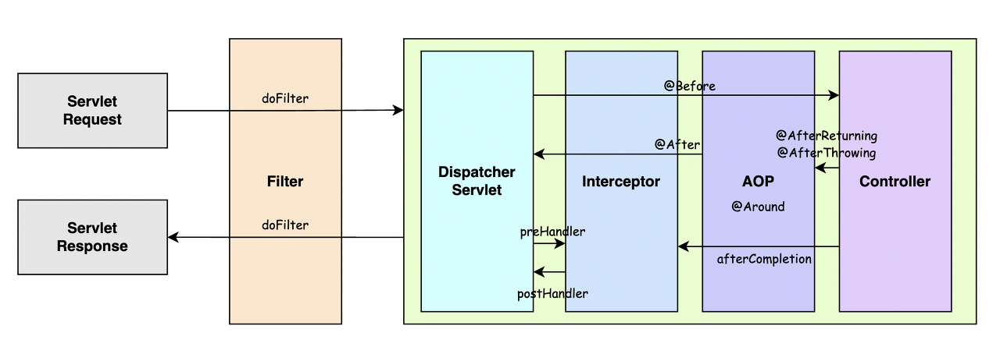

<!-- Filter와 Interceptor의 차이에 대해서 설명해주세요. -->
<details>
  <summary><span style="border-bottom:0.05em solid"><strong>Filter와 Interceptor의 차이에 대해 설명해주세요.</strong></span></summary>
<hr>
Filter는 Java가 지원하는 기술로, Spring Context 외부에서 동작하며 Dispatcher Servlet에 요청이 전달되기 전/후에 url 패턴에 맞는 모든 요청에 대해 부가 작업을 처리할 수 있도록 합니다. Dispatch Servlet 이전에 WAS 내에서 Application Context에 등록된 필터가 실행됩니다.
<br></br>
Interceptor는 Spring이 제공하는 기술로써, Spring Context 내부에서 동작하며 Dispatcher Servlet이 Controller를 호출하기 전 / 후에 인터셉터가 끼어들어 요청과 응답을 참조하거나 가공할 수 있는 기능을 제공합니다.
<br></br>

<details>
    <summary><span style="border-bottom:0.05em solid"><strong>번외</strong></span></summary>
    

    필터는 전후처리를 doFilter로 공통적으로 처리합니다.

    인터셉터는 preHanlde()과 postHandle() 메소드로 분기가 명확하게 나누어져 있습니다.

    [작동 순서]
    Servlet Request ➡ doFilter ➡ Dispatch Servlet ➡ preHandler ➡ Controller ➡ Service

    Service ➡ Controller ➡ postHandler ➡ Dispatch Servlet ➡ doFilter ➡ Servlet Response

  </details>
<hr>
</details>

<!-- Spring Bean Scope의 종류와 각각의 범위에 대해서 설명해주세요. -->
<details>
  <summary><span style="border-bottom:0.05em solid"><strong>Spring Bean Scope의 종류와 각각의 범위에 대해서 설명해주세요.</strong></span></summary>
<hr>

**Spring Bean의 Scope는 빈이 존재할 수 있는 생명 주기(범위)를 뜻하며,**<br>
**Singleton, Prototype, Request, Session, Application, Websocket 등이 있습니다.**

**Singleton은** 기본값으로 스프링 컨테이너의 시작과 종료까지 **단 하나의 객체만** 생성됩니다.<br>
**Prototype은** 빈의 생성부터 의존관계 주입까지만 관여하며 스프링 컨테이너에게 빈을 요청할 때마다 매번 새로운 객체가 생성됩니다.<br>
**Request는** 요청이 들어와서 나갈때까지 각각의 HTTP Request마다 **단 하나의 객체만** 생성됩니다.<br>
**Session은** HTTP Session과 동일한 생명주기를 가지며 각 세션당 **단 하나의 객체만** 생성됩니다.<br>
**Application은** ServletContext와 동일한 생명주기를 가지며 각 Application당 **단 하나의 객체만** 생성됩니다.<br>
**WebSocket은** WebSocket과 동일한 생명주기를 가지며 각 WebSocket당 **단 하나의 객체만** 생성됩니다.<br>

<br>

<details>
    <summary><span style="border-bottom:0.05em solid"><strong>IoC(Inversion of Control)</strong></span></summary>

**IoC(Inversion of Control)란** "제어의 역전" 이라는 의미로 <br>
**메소드나 객체의 호출작업을 개발자가 직접 하는 것이 아니라, 외부에서 대신하는 것을 말합니다.**

IoC는 제어의 역전이라고 말하며, 간단히 말해 "제어의 흐름을 바꾼다"라고 합니다.
**객체의 의존성을 역전시켜 객체 간의 결합도를 줄이고 유연한 코드를 작성할 수 있게 하여**
**가독성 및 테스트, 코드 중복, 유지 보수를 편하게 할 수 있게 합니다.**

  </details>

<hr>
</details>

<!-- 스프링에서 AOP가 무엇인가요? -->
<details>
  <summary><span style="border-bottom:0.05em solid"><strong>스프링에서 AOP가 무엇인가요?</strong></span></summary>
<hr>
AOP란 관점 지향 프로그래밍으로

어떠한 핵심 비즈니스 로직의 클래스나 메소드를 기준으로 관점을 잡고 모듈화하고
공통되고 반복적인 코드들을 모듈과 분리하여 재사용하는 것을 의미합니다.
<br></br>
스프링 AOP의 목적은 OOP와 마찬가지로 모듈화해서 재사용 가능한 구성을 만드는 것이고, 모듈화된 객체를 편하게 적용할 수 있게 함으로써 개발자가 비즈니스 로직을 구현하는 데만 집중할 수 있게 도와주는 것입니다.
<br></br>
Spring은 Bean으로 등록된 객체에 프록시 객체를 사용하여 접근제어 및 부가기능을 추가할 수 있습니다.
<br></br>

<details>
    <summary><span style="border-bottom:0.05em solid"><strong>번외</strong></span></summary>

    ※ Spring AOP의 Advice 종류
    Before: 모듈 실행 전
    After Returning: 모듈 실행 후(예외 발생 X)
    Afther Throwing: 모듈 실행 도중 예외 발생 시
    After: 모듈 실행 후 예외, 결과에 상관 없이
    Around: 모듈 실행 전, 후, 익셉션 발생 시

  </details>
<hr>
</details>

<!--Spring과 Spring Boot의 차이점에 대해 설명해주세요. -->
<details>
  <summary><span style="border-bottom:0.05em solid"><strong>Spring과 Spring Boot의 차이점에 대해 설명해주세요.</strong></span></summary>
<hr>

첫째, 기존 스프링에서는 웹 어플리케이션이 압축된 war파일과 이 war파일을 실행시킬 WAS를 함께 배포했지만,
스프링 부트는 **내장 WAS**를 통해 단순히 jar파일만 통해서 배포가 가능합니다.

둘째, 각종 환경 설정등을 **@SpringBootApplication** 어노테이션을 통해 자동으로 설정해주기 때문에
설정들을 하나하나 따로 설정해줄 필요가 없습니다.

셋째, 스프링 부트는 spring-boot-starter에 의해 모든 **의존성을 좀 더 편리**하게 관리할 수 있게 해줍니다.
예를 들어, spring-boot-starter-jpa의 의존성을 추가했을 때, spring-aop, spring-jdbc등이 같이 선언되어 있기 때문에
의존성을 추가하기 편리합니다.

<hr>
</details>

<!--Spring에서 CORS 에러를 해결하기 위한 방법을 설명해주세요. -->
<details>
  <summary><span style="border-bottom:0.05em solid"><strong>Spring에서 CORS 에러를 해결하기 위한 방법을 설명해주세요.</strong></span></summary>
<hr>

CORS 에러를 해결하기 위해서는

1. @CrossOrigin 어노테이션을 CORS 정책을 적용할 대상에 적용하거나,
2. WebMvcConfigurer를 상속한 Config 클래스를 만들어서 CORS 정책을 설정하거나,
3. RestTemplate을 이용한 프록시 서버를 구현하는 방법이 있습니다.

<details>
    <summary><span style="border-bottom:0.05em solid"><strong>번외</strong></span></summary>

1. @CrossOrigin 어노테이션 활용하기

   - spring 4.2 버전부터 지원하며, Controller 혹은 method단위로 적용이 가능합니다.
   - 허용할 도메인과, 헤더, 캐시 저장 시간 설정이 가능합니다.

   ```JAVA
   @CrossOrigin(origins = "http://localhost:8080")
   @GetMapping("/greeting")
   public Greeting greeting(@RequestParam(required = false, defaultValue = "World") String name) {
     System.out.println("==== get greeting ====");
     return new Greeting(counter.incrementAndGet(), String.format(template, name));
   }
   ```

   2. WebConfig 파일에 CORS 설정 처리하기

   - WebMvcConfigurer를 상속받는 WebConfig 파일을 만들고, @Configuration을 통해 환경파일로 설정합니다.
   - 허용할 도메인, 프론트 도메인, 헤더, HTTP 메섣, 쿠키 요청 여부, 캐싱 시간 설정이 가능합니다.

   ```JAVA
   @Configuration
   public class CorsConfig implements WebMvcConfigurer {

       @Override
       public void addCorsMappings(CorsRegistry registry) {
           registry.addMapping("/**")
                   .allowedOrigins("*")
                   .allowedMethods("GET", "POST", "PUT", "PATCH", "OPTIONS")
                   .allowedHeaders("headers")
                   .maxAge(3000);
       }
   }
   ```

   3. 프록시 서버 사용하기

   - 서버 단에서 CORS 정책 위반으로 400, 500번대의 상태코드를 반환하지 않고 200번 코드를 반환합니다.
   - CORS 이슈는 브라우저 단에서 서버의 Access-Control-Allow-Origin 값을 보고 방금 보낸 요청의 출처가 허용되는지 판단하고, 허용되지 않으면 발생하기 때문에
   - 요청을 보내는 쪽에서 프록시 서버를 만들어 간적접으로 전달하면 응답을 받을 수 있습니다.

  </details>
<hr>
</details>
